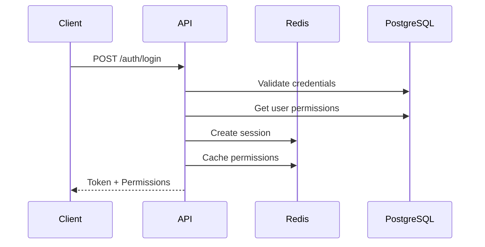

# SPÉCIFICATIONS TECHNIQUES - MODULE AUTHENTIFICATION

## 📋 Informations Générales

- **Module :** Authentification & Gestion des Sessions
- **Version :** 1.0 MVP
- **Priorité :** Must Have (Core Infrastructure)
- **Architecture :** Services → Queries → DB (PostgreSQL + Redis)

## 🎯 Objectif

Développer un système d'authentification multi-tenant robuste avec :

- Tokens opaques UUID stockés dans Redis
- Système de permissions à 3 niveaux (Profils → Modules → Rubriques)
- Distinction stricte Back-Office / Front-Office
- Fallback PostgreSQL pour continuité de service

## 🏗️ Architecture Technique

```
internal/modules/auth/
├── auth.module.go              # Module Fx
├── controllers/
│   └── auth.controller.go      # Login/Logout/Me
├── services/
│   ├── auth.service.go         # Logique authentification
│   ├── session.service.go      # Gestion sessions Redis/PostgreSQL
│   └── permission.service.go   # Gestion permissions
├── dto/
│   └── auth.dto.go            # Types Request/Response
└── queries/
    ├── user.postgres.go        # Requêtes utilisateurs
    └── permission.postgres.go  # Requêtes permissions
```

## 🔧 API Endpoints

### **POST /api/v1/auth/login**

#### **Description**

Authentification utilisateur avec retour des permissions complètes

#### **Headers Requis**

```http
X-Establishment-Code: CENTREA
X-Client-Type: front-office  # ou back-office
Content-Type: application/json
```

#### **Request Body**

```json
{
  "identifiant": "john.doe",
  "password": "SecurePass123!"
}
```

#### **Response 200 - Success**

```json
{
  "success": true,
  "data": {
    "token": "a1b2c3d4-e5f6-47h8-89i9-j0k1l2m3n4o5",
    "expires_at": "2025-01-15T15:30:00Z",
    "front_office": false,
    "back_office": true,
    "user": {
      "id": "550e8400-e29b-41d4-a716-446655440001",
      "identifiant": "admin.system",
      "nom": "COULIBALY",
      "prenoms": "Drissa",
      "telephone": "0612345678",
      "est_admin": true,
      "type_admin": "super_admin",
      "est_admin_tir": false,
      "must_change_password": false,
      "est_medecin": false,
      "role_metier": null
    },
    "permissions": [
      {
        "code_module": "ETABLISSEMENTS",
        "nom_standard": "Gestion des établissements",
        "nom_personnalise": null,
        "description": "Module de gestion complète des établissements",
        "rubriques": [] // Vide = accès à TOUTES les rubriques
      },
      {
        "code_module": "USERS",
        "nom_standard": "Gestion des utilisateurs",
        "nom_personnalise": "Utilisateurs & Permissions",
        "description": "Module de gestion des utilisateurs et leurs permissions",
        "rubriques": [
          // Liste = accès RESTREINT à ces rubriques uniquement
          {
            "code_rubrique": "CREATE_USER",
            "nom": "Créer un utilisateur",
            "description": "Permet la création de nouveaux utilisateurs",
            "ordre_affichage": 1
          },
          {
            "code_rubrique": "VIEW_USER",
            "nom": "Consulter les utilisateurs",
            "description": "Permet la consultation des utilisateurs",
            "ordre_affichage": 2
          }
        ]
      },
      {
        "code_module": "CAISSE",
        "nom_standard": "Caisse",
        "nom_personnalise": null,
        "description": "Module de gestion de la caisse",
        "rubriques": [] // Accès complet
      }
    ],
    "setup": {
      // Uniquement pour back-office
      "est_termine": false,
      "etape_actuelle": 1,
      "total_etapes": 5
    }
  }
}
```

#### **Response 401 - Identifiants Incorrects**

```json
{
  "error": "Identifiant ou mot de passe incorrect",
  "details": {
    "code": "INVALID_CREDENTIALS",
    "attempts_remaining": 3
  }
}
```

#### **Response 403 - Type Client Incorrect**

```json
{
  "error": "Accès refusé à cette interface",
  "details": {
    "code": "CLIENT_TYPE_MISMATCH",
    "reason": "Compte administrateur requis pour le back-office"
  }
}
```

#### **Response 429 - Rate Limit**

```json
{
  "error": "Trop de tentatives de connexion",
  "details": {
    "code": "RATE_LIMIT_EXCEEDED",
    "retry_after_seconds": 900
  }
}
```

#### **Règles Métier**

1. **Validation Établissement** : Via EstablishmentMiddleware (header obligatoire)
2. **Cohérence Client Type** :
   - `back-office` → `est_admin = true` requis
   - `front-office` → `est_admin = false` requis
3. **Rate Limiting** : Max 5 tentatives par 15 minutes par identifiant
4. **Token Format** : UUID v4 (36 caractères)
5. **Session TTL** : 1 heure
6. **Permissions Structurées** :
   - `rubriques: []` → Accès complet au module
   - `rubriques: [...]` → Accès restreint aux rubriques listées
7. **Setup Info** : Retourné uniquement pour back-office

#### **Processus Interne**



---

### **POST /api/v1/auth/logout**

#### **Description**

Déconnexion utilisateur avec révocation immédiate de la session

#### **Headers Requis**

```http
X-Establishment-Code: CENTREA
Authorization: Bearer {token}
```

#### **Response 200 - Success**

```json
{
  "success": true,
  "message": "Déconnexion réussie"
}
```

#### **Response 401 - Token Invalide**

```json
{
  "error": "Session invalide ou expirée",
  "details": {
    "code": "INVALID_TOKEN"
  }
}
```

#### **Règles Métier**

1. **Suppression Redis** : Session supprimée immédiatement
2. **Suppression Index** : Token retiré de l'index utilisateur
3. **Audit Log** : Événement logout tracé
4. **Idempotent** : Logout multiple sur même token = succès

---

### **GET /api/v1/auth/me**

#### **Description**

Récupération des informations utilisateur courant et permissions

#### **Headers Requis**

```http
X-Establishment-Code: CENTREA
Authorization: Bearer {token}
```

#### **Response 200 - Success**

```json
{
  "success": true,
  "data": {
    "user": {
      "id": "550e8400-e29b-41d4-a716-446655440001",
      "identifiant": "john.doe",
      "nom": "DOE",
      "prenoms": "John",
      "telephone": "0612345678",
      "est_admin": false,
      "est_medecin": true,
      "role_metier": "Médecin généraliste"
    },
    "permissions": [
      {
        "code_module": "CONSULTATION",
        "nom_standard": "Consultation",
        "nom_personnalise": null,
        "description": "Module de consultation médicale",
        "rubriques": [] // Accès complet
      }
    ],
    "session": {
      "token": "current-token-uuid",
      "expires_at": "2025-01-15T15:30:00Z",
      "client_type": "front-office"
    }
  }
}
```

---

## 🗄️ Schémas Redis

### **Session**

```
Clé : soins_suite_{etablissement}_auth_session:{token}
TTL : 3600s
Type : HASH

Champs :
{
  "user_id": "uuid",
  "etablissement_id": "uuid",
  "etablissement_code": "CENTREA",
  "client_type": "front-office|back-office",
  "ip_address": "192.168.1.1",
  "user_agent": "Mozilla/5.0...",
  "created_at": "2025-01-15T14:30:00Z",
  "last_activity": "2025-01-15T14:45:00Z"
}
```

### **Permissions Cache**

```
Clé : soins_suite_{etablissement}_auth_permissions:{user_id}
TTL : 3600s
Type : SET

Membres :
- module:CONSULTATION
- module:CAISSE
- rubrique:USERS:CREATE_USER
- rubrique:USERS:VIEW_USER
```

### **Rate Limiting**

```
Clé : soins_suite_{etablissement}_auth_ratelimit:{identifiant}
TTL : 900s
Type : STRING

Valeur : "5"  // Nombre de tentatives
```

---

## 📊 Requêtes SQL

### **GetUserWithPermissions**

```sql
WITH user_modules_access AS (
    -- Modules via profils
    SELECT DISTINCT
        m.id, m.code_module, m.nom_standard, m.nom_personnalise,
        m.description, pm.acces_toutes_rubriques, 'profil' as source
    FROM user_profil_utilisateurs pu
    JOIN user_profil_modules pm ON pm.profil_template_id = pu.profil_template_id
    JOIN base_module m ON m.id = pm.module_id
    WHERE pu.utilisateur_id = $1 AND pu.est_actif = TRUE

    UNION

    -- Modules directs
    SELECT DISTINCT
        m.id, m.code_module, m.nom_standard, m.nom_personnalise,
        m.description, um.acces_toutes_rubriques, 'direct' as source
    FROM user_modules um
    JOIN base_module m ON m.id = um.module_id
    WHERE um.utilisateur_id = $1 AND um.est_actif = TRUE
),
user_rubriques_access AS (
    -- Rubriques via profils
    SELECT pr.module_id, r.id, r.code_rubrique, r.nom,
           r.description, r.ordre_affichage
    FROM user_profil_utilisateurs pu
    JOIN user_profil_rubriques pr ON pr.profil_template_id = pu.profil_template_id
    JOIN base_rubrique r ON r.id = pr.rubrique_id
    WHERE pu.utilisateur_id = $1 AND pu.est_actif = TRUE

    UNION

    -- Rubriques directes
    SELECT umr.module_id, r.id, r.code_rubrique, r.nom,
           r.description, r.ordre_affichage
    FROM user_modules_rubriques umr
    JOIN base_rubrique r ON r.id = umr.rubrique_id
    WHERE umr.utilisateur_id = $1 AND umr.est_actif = TRUE
)
SELECT
    m.code_module,
    m.nom_standard,
    m.nom_personnalise,
    m.description,
    CASE
        WHEN bool_or(m.acces_toutes_rubriques) THEN '[]'::jsonb
        ELSE jsonb_agg(
            DISTINCT jsonb_build_object(
                'code_rubrique', r.code_rubrique,
                'nom', r.nom,
                'description', r.description,
                'ordre_affichage', r.ordre_affichage
            ) ORDER BY r.ordre_affichage
        ) FILTER (WHERE r.id IS NOT NULL)
    END as rubriques
FROM user_modules_access m
LEFT JOIN user_rubriques_access r ON r.module_id = m.id
    AND NOT bool_or(m.acces_toutes_rubriques)
GROUP BY m.code_module, m.nom_standard, m.nom_personnalise, m.description
ORDER BY m.code_module;
```

---

## ⚡ Règles de Performance

1. **Cache First** : Toujours vérifier Redis avant PostgreSQL
2. **Pipeline Redis** : Opérations groupées pour login
3. **Permissions en SET** : Vérification O(1) avec SISMEMBER
4. **TTL Cohérents** : Session et permissions = 1h
5. **Fallback PostgreSQL** : Table `user_session` si Redis down

---

## 🛡️ Sécurité

1. **Hashage** : bcrypt avec cost 12 + salt unique
2. **Tokens** : UUID v4 crypto-secure
3. **Rate Limiting** : 5 tentatives / 15 minutes
4. **Isolation** : Multi-tenant strict par établissement
5. **Audit** : Tous les événements auth tracés

---

## ✅ Checklist Implémentation

- [ ] **AuthController** : 3 endpoints (login, logout, me)
- [ ] **AuthService** : Validation credentials + génération token
- [ ] **SessionService** : CRUD sessions Redis + fallback PostgreSQL
- [ ] **PermissionService** : Aggregation permissions + cache
- [ ] **Queries PostgreSQL** : Requêtes optimisées avec CTEs
- [ ] **Redis Integration** : Sessions + permissions + rate limit
- [ ] **Middlewares** :
  - [ ] SessionMiddleware : Validation token
  - [ ] PermissionMiddleware : Contrôle accès
- [ ] **Tests** : Unitaires + intégration + charge
- [ ] **Documentation** : OpenAPI/Swagger

---

## 📝 Notes d'Implémentation

### **Gestion des Erreurs**

```go
type AuthError struct {
    Code    string `json:"code"`
    Message string `json:"message"`
    Details map[string]interface{} `json:"details,omitempty"`
}
```

### **Context Enrichi**

```go
// Dans gin.Context après auth
session := c.MustGet("session").(SessionContext)
permissions := c.MustGet("permissions").([]string)
```

### **Validation Permissions**

```go
// Middleware pour routes protégées
router.GET("/api/v1/users",
    SessionMiddleware(),
    PermissionMiddleware("module:USERS"),
    controller.GetUsers,
)
```

---

**Ces spécifications garantissent un système d'authentification robuste, performant et maintenable pour Soins Suite.**
