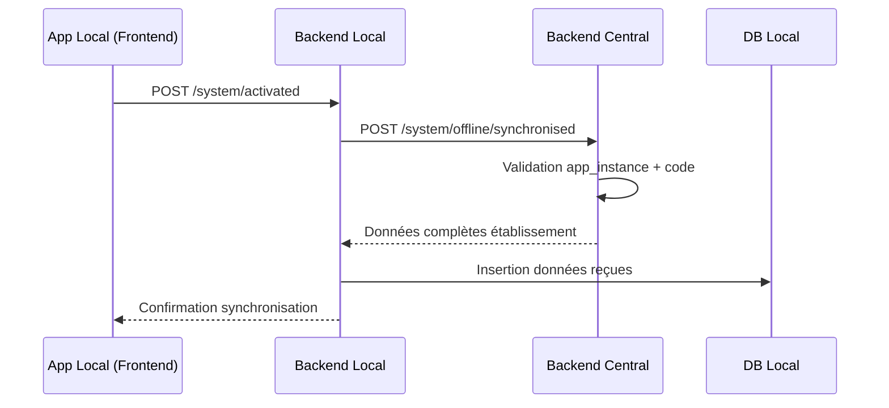

# SPÉCIFICATIONS TECHNIQUES SOINS SUITE - MVP

## 1. MIDDLEWARE - GESTION MULTI-TENANT & SÉCURITÉ

### 📋 Informations Générales

- **Module :** Middleware Multi-tenant & Licence
- **Version :** 1.0 MVP
- **Priorité :** Must Have (Core Infrastructure)
- **Architecture :** Gin Middleware Chain

### 🎯 Objectif

Développer les middlewares essentiels pour :

- Validation du code établissement transmis par le frontend
- Vérification d'existence et statut de l'établissement
- Contrôle de licence et modules autorisés
- Isolation multi-tenant complète

### 🏗️ Architecture Middleware Chain

```
Request → CORS → Recovery → Logger →
EstablishmentMiddleware → LicenseMiddleware →
Controller
```

### 📁 Arborescence Middlewares

```
internal/shared/middleware/
├── middleware.module.go                    # Module Fx principal middlewares
├── authentication/
│   ├── establishment.middleware.go         # EstablishmentMiddleware
│   └── license.middleware.go               # LicenseMiddleware
├── security/
│   ├── cors.go                            # Configuration CORS
│   ├── recovery.go                        # Recovery from panics
│   └── security.go                        # Headers sécurité
├── logging/
│   └── logger.go                          # Logger Gin principal
└── validation/
    └── context_validator.go               # Validation contexte requests
```

### 🔧 MIDDLEWARE 1 : EstablishmentMiddleware

#### Responsabilités

1. **Extraction code établissement** depuis header `X-Establishment-Code`
2. **Validation existence** établissement
3. **Contrôle statut** (actif/suspendu)
4. **Injection contexte** pour controllers

#### Headers Requis

```http
X-Establishment-Code: CENTREA
```

#### API Endpoints Affectés

**TOUS** les endpoints `/api/v1/*` sauf :

- `/health`
- `/ready`
- `/api/v1/system/ping`
- `/api/v1/system/offline/synchronised`

#### Règles Métier

- **Header obligatoire** : Tous appels API nécessitent `X-Establishment-Code`
- **Format strict** : Code alphanumérique, 3-20 caractères, majuscules
- **Cache optimisé** : Cache sans expiration (données immuables : ID, app_instance, code, statut)
- **Isolation totale** : Aucune fuite de données entre établissements

#### Schema Cache EstablishmentMiddleware

```
Clé : soins_suite_{code_etablissement}_cache_middleware:establishment
TTL : Infini (données immuables)
Données : {"id": "uuid", "app_instance": "uuid", "code": "CODE", "statut": "actif"}
```

#### Réponses d'Erreur - Status 460

##### Code Manquant

```json
{
  "error": "Code établissement requis",
  "code": "ESTABLISHMENT_CODE_REQUIRED",
  "details": {
    "header_required": "X-Establishment-Code"
  }
}
```

##### Format Invalide

```json
{
  "error": "Format code établissement invalide",
  "code": "ESTABLISHMENT_CODE_INVALID_FORMAT",
  "details": {
    "code_recu": "inv@lid",
    "format_requis": "Alphanumérique, 3-20 caractères, majuscules"
  }
}
```

##### Établissement Inexistant

```json
{
  "error": "Établissement non trouvé",
  "code": "ESTABLISHMENT_NOT_FOUND",
  "details": {
    "establishment_code": "CENTREA"
  }
}
```

##### Établissement Suspendu

```json
{
  "error": "Établissement suspendu",
  "code": "ESTABLISHMENT_SUSPENDED",
  "details": {
    "establishment_code": "CENTREA",
    "statut": "suspendu",
    "motif": "Licence expirée"
  }
}
```

### 🔧 MIDDLEWARE 2 : LicenseMiddleware

#### Responsabilités

1. **Contrôle licence active**
2. **Vérification expiration** (mode online uniquement)
3. **Validation modules autorisés**
4. **Gestion cache licence**

#### Règles Métier

- **Licence obligatoire** : Établissement DOIT avoir licence active
- **Premium local** : Aucune expiration en mode local
- **Expiration online** : Contrôle strict en mode online
- **Modules JSONB** : Validation depuis `modules_autorises`
- **Cache 24h** : Optimisation performances pour données semi-statiques

#### Schema Cache LicenseMiddleware

```
Clé : soins_suite_{code_etablissement}_cache_middleware:license
TTL : 24 heures (86400s)
Données : {"id": "uuid", "type_licence": "standard", "mode_deploiement": "online",
          "statut": "actif", "modules_autorises": ["ACCUEIL", "CAISSE"],
          "date_expiration": "2026-01-15T00:00:00Z"}
```

#### Réponses d'Erreur - Status 465 (Licence)

##### Licence Inactive

```json
{
  "error": "Licence inactive",
  "code": "LICENSE_INACTIVE",
  "details": {
    "establishment_code": "CENTREA",
    "license_status": "revoquee"
  }
}
```

##### Licence Expirée

```json
{
  "error": "Licence expirée",
  "code": "LICENSE_EXPIRED",
  "details": {
    "establishment_code": "CENTREA",
    "expiration_date": "2025-08-15T00:00:00Z",
    "days_expired": 16
  }
}
```

##### Licence Inexistante

```json
{
  "error": "Aucune licence trouvée",
  "code": "LICENSE_NOT_FOUND",
  "details": {
    "establishment_code": "CENTREA"
  }
}
```

#### Réponses d'Erreur - Status 470 (Module)

##### Module Non Autorisé

```json
{
  "error": "Module non autorisé par la licence",
  "code": "MODULE_NOT_LICENSED",
  "details": {
    "establishment_code": "CENTREA",
    "module_requested": "CARDIOLOGIE",
    "modules_authorized": ["ACCUEIL", "CAISSE", "INFIRMERIE"]
  }
}
```

### 🔧 Structure Contexte Request

#### Gin Context Enrichi

```go
// Données injectées dans gin.Context
type EstablishmentContext struct {
    ID                   string `json:"id"`
    Code                 string `json:"code"`
    Nom                  string `json:"nom"`
}

type LicenseContext struct {
    ID                string   `json:"id"`
    Type              string   `json:"type"`         // premium|standard|evaluation
    Mode              string   `json:"mode"`         // local|online
    ModulesAutorises  []string `json:"modules_autorises"`
    DateExpiration    *string  `json:"date_expiration"`
    EstActive         bool     `json:"est_active"`
}

// Accès dans controllers :
// establishment := c.MustGet("establishment").(EstablishmentContext)
// license := c.MustGet("license").(LicenseContext)
```

---

## 2. MODULE SYSTEM - INFORMATIONS ÉTABLISSEMENT & LICENCE

### 📋 Informations Générales

- **Module :** System - Informations Établissement
- **Version :** 1.0 MVP
- **Priorité :** Must Have
- **Endpoints :** Lecture + Activation Offline

### 🎯 Objectif

Fournir aux applications front-end les informations essentielles sur :

- État de l'établissement
- Statut et détails de la licence
- Modules autorisés et disponibles
- Configuration système de base
- Activation et synchronisation mode offline

### 🏗️ Architecture Technique MVP

```
internal/modules/system/
├── system.module.go              # Module Fx
├── controllers/
│   └── system.controller.go      # Controller unique MVP
├── services/
│   └── system.service.go         # Service unique MVP
├── dto/
│   └── system.dto.go             # DTOs système
└── queries/
    └── system.postgres.go        # Requêtes SQL
```

### 🔧 API Endpoints MVP - Mode Online/Local

#### **GET /api/v1/system/info**

**Description** : Informations complètes établissement + licence

**Headers Requis :**

```http
X-Establishment-Code: CENTREA
```

**Response 200 :**

```json
{
  "success": true,
  "data": {
    "etablissement": {
      "id": "uuid-etablissement",
      "code": "CENTREA",
      "nom": "Centre Médical A",
      "nom_court": "CMA",
      "ville": "Abidjan",
      "created_at": "2025-01-15T10:00:00Z"
    },
    "licence": {
      "id": "uuid-licence",
      "type": "standard",
      "mode_deploiement": "online",
      "statut": "actif",
      "date_activation": "2025-01-15T10:00:00Z",
      "date_expiration": "2026-01-15T00:00:00Z",
      "jours_restants": 145,
      "modules_autorises": ["ACCUEIL", "CAISSE", "INFIRMERIE", "CARDIOLOGIE"]
    },
    "modules_disponibles": [
      {
        "code_module": "ACCUEIL",
        "nom_standard": "Accueil",
        "est_medical": false,
        "peut_prendre_ticket": true,
        "autorise": true,
        "est_actif": true
      },
      {
        "code_module": "CARDIOLOGIE",
        "nom_standard": "Cardiologie",
        "est_medical": true,
        "peut_prendre_ticket": true,
        "autorise": true,
        "est_actif": true
      },
      {
        "code_module": "CHIRURGIE",
        "nom_standard": "Chirurgie",
        "est_medical": true,
        "peut_prendre_ticket": true,
        "autorise": false,
        "est_actif": true
      }
    ],
    "configuration": {
      "duree_validite_ticket_jours": 15,
      "nb_souches_par_caisse": 100,
      "garde_active": true,
      "garde_heure_debut": "18:00:00",
      "garde_heure_fin": "08:00:00"
    }
  }
}
```

#### **GET /api/v1/system/modules/authorized**

**Description** : Modules autorisés uniquement (pour navigation dynamique)

**Headers Requis :**

```http
X-Establishment-Code: CENTREA
```

**Response 200 :**

```json
{
  "success": true,
  "data": {
    "modules_autorises": [
      {
        "code_module": "ACCUEIL",
        "nom_standard": "Accueil",
        "est_medical": false,
        "peut_prendre_ticket": true,
        "est_module_back_office": false
      },
      {
        "code_module": "CARDIOLOGIE",
        "nom_standard": "Cardiologie",
        "est_medical": true,
        "peut_prendre_ticket": true,
        "est_module_back_office": false
      }
    ]
  }
}
```

### 🔧 API Endpoints MVP - Mode Offline Uniquement

#### **POST /api/v1/system/activated**

**Description** : Endpoint appelé par le back-office local pour déclencher la vérification de synchronisation

**Headers Requis :**

```http
X-Establishment-Code: CENTREA
X-Client-Type : back-office
```

**Request Body :**

```json
{
  "code_etablissement": "CENTREA"
}
```

**Response 200 :**

```json
{
  "success": true,
  "data": {
    "synchronisation_effectuee": true,
    "etablissement_existe": true,
    "message": "Synchronisation des données depuis le serveur central effectuée"
  }
}
```

**Response 400 :**

```json
{
  "error": "Etablissement sanitaire non trouvé ou pas encore configuré",
  "code": "APP_INSTANCE_NOT_FOUND",
  "details": {} // Détail technique pour dev
}
```

**Règles Métier Spécifiques :**

- **Middleware Autorisé** : Route utilisant le middleware EstablishmentMiddleware. `X-Establishment-Code`
- **Header Obligatoire** : S'assurer que l'en-tête contienne : `X-Client-Type : back-office` sinon renvoyer un code d'erreur 400
- Analyse obligatoirement le schéma de la BDD : `database/schemas/00.initial.sql`
- **Règle métier** :
  - Récupérer la variable d'environnement `APP_INSTANCE` et le code de l'établissement
  - Appeler le backend en ligne à l'endpoint POST `/api/v1/system/offline/synchronised`
  - Configurer l'URL du backend central dans le .env et le `internal/app/config.go`
  - Si status 200, récupérer toutes les informations de l'établissement, des modules disponibles, du super-admin à insérer dans la BDD respectivement (base_etablissement, base_licence, base_module, base_rubrique, base_user_utilisateur)
  - Si status différent de 200, bien gérer les réponses avec des erreurs bien concises et précises . Prendre en compte le cas où la tentative d'acccès à Backend en ligne est impossible.

#### **POST /api/v1/system/offline/synchronised**

**Description** : Endpoint pour synchronisation initiale des données d'établissement (appelé par serveur local vers serveur central)

**Note :** Cet endpoint ne nécessite PAS le header `X-Establishment-Code` car les infos sont dans le body

**Headers Requis :**

```http
X-Establishment-Code: CENTREA
```

**Request Body :**

```json
{
  "app_instance": "uuid-app-instance-etablissement"
}
```

**Response 200 - Synchronisation Réussie :**

```json
{
  "success": true,
  "data": {
    "etablissement": {
      "id": "uuid-etablissement",
      "app_instance": "uuid-app-instance-etablissement",
      "etablissement_code": "CENTREA",
      "nom": "Centre Médical A",
      "nom_court": "CMA",
      "adresse_complete": "Rue des Palmiers, Cocody",
      "ville": "Abidjan",
      "commune": "Cocody",
      "telephone_principal": "+225 01 02 03 04 05",
      "email": "contact@centremedical-a.ci",
      "duree_validite_ticket_jours": 15,
      "nb_souches_par_caisse": 100,
      "garde_heure_debut": "18:00:00",
      "garde_heure_fin": "08:00:00",
      "created_at": "2025-01-15T10:00:00Z"
    },
    "licence": {
      "id": "uuid-licence",
      "etablissement_id": "uuid-etablissement",
      "mode_deploiement": "local",
      "type_licence": "premium",
      "modules_autorises": [
        "ACCUEIL",
        "CAISSE",
        "INFIRMERIE",
        "CARDIOLOGIE",
        "CHIRURGIE"
      ], // En local, tous les modules disponibles sont accordées (autorisées) à l'établissement.
      "date_activation": "2025-01-15T10:00:00Z",
      "date_expiration": null,
      "statut": "actif",
      "sync_initial_complete": false,
      "created_at": "2025-01-15T10:00:00Z"
    },
    "modules": [
      {
        "id": "uuid-module-1",
        "numero_module": 1,
        "code_module": "ACCUEIL",
        "nom_standard": "Accueil",
        "description": "Module d'accueil et orientation des patients",
        "est_medical": false,
        "est_obligatoire": true,
        "est_actif": true,
        "est_module_back_office": false,
        "peut_prendre_ticket": true,
        "rubriques": [
          {
            "id": "uuid-rubrique-1",
            "code_rubrique": "GESTION_PATIENTS",
            "nom": "Gestion des patients",
            "description": "Création et modification des fiches patients",
            "ordre_affichage": 1,
            "est_obligatoire": true,
            "est_actif": true
          }
        ]
      }
    ],
    "super_admin": {
      "id": "uuid-admin-tir",
      "etablissement_id": "uuid-etablissement",
      "identifiant": "admin.tir",
      "nom": "Admin",
      "prenoms": "TIR",
      "telephone": "+225 00 00 00 00",
      "password_hash": "$2a$10$hashedpassword",
      "salt": "randomsalt",
      "must_change_password": true,
      "est_admin": true,
      "type_admin": "super_admin",
      "est_admin_tir": true,
      "est_temporaire": false,
      "statut": "actif",
      "created_at": "2025-01-15T10:00:00Z"
    },
    "sync_metadata": {
      "sync_timestamp": "2025-08-31T10:00:00Z",
      "total_modules": 5,
      "total_rubriques": 15,
      "version_donnees": "1.0"
    }
  }
}
```

**Response 404 :**

```json
{
  "error": "Établissement ou instance non trouvé(e)",
  "code": "ESTABLISHMENT_OR_INSTANCE_NOT_FOUND",
  "details": {
    "app_instance": "uuid-app-instance-etablissement",
    "code_etablissement": "CENTREA"
  }
}
```

**Response 409 :**

```json
{
  "error": "Établissement déjà synchronisé",
  "code": "ESTABLISHMENT_ALREADY_SYNCHRONIZED",
  "details": {
    "app_instance": "uuid-app-instance-etablissement",
    "code_etablissement": "CENTREA",
    "date_derniere_sync": "2025-08-25T10:00:00Z"
  }
}
```

**Règles Métier Spécifiques :**

- **Middleware Autorisé** : Route utilisant le middleware EstablishmentMiddleware, LicenceMiddleware.
- Analyse obligatoirement le schéma de la BDD : `database/schemas/00.initial.sql`
- **Règle métier** :
  - Vérifier que les champs `sync_initial_complete` et `date_sync_initial` de la table `base_licence` sont à false et null respectivement sinon renvoyé le code d'erreur 409 comme spécifié dans le format de la réponse.
  - Vérifier que app_instance existe dans base_etablissement et concorde bien avec le code de l'établissement. Sinon renvoyer un code d'erreur 404.
  - Si oui récupérer les informations de l'établissement,licences, des modules disponibles, du super-admin(base_etablissement, base_licence, base_module, base_rubrique, base_user_utilisateur) comme spécifié dans le format de la réponse.
  - Mettre les champs `sync_initial_complete` et `date_sync_initial` dans la table `base_licence` respectivement à true, date en cours
  - Retourner la réponse statut 200

### 🔧 Règles Métier MVP

#### Validation Licence

- **Premium Local** : Pas d'expiration (date_expiration = NULL)
- **Standard/Evaluation** : Expiration obligatoire
- **Mode Online** : Contrôle expiration systématique
- **Modules JSONB** : Intersection avec modules disponibles

#### Règles Synchronisation Offline

- **App Instance Unique** : Vérification `app_instance` + `code_etablissement` dans `base_etablissement`
- **Sync Unique** : Un établissement ne peut être synchronisé qu'une seule fois (flag `sync_initial_complete`)
- **Données Complètes** : Retour de TOUTES les données nécessaires
- **Modules avec Rubriques** : Structure complète pour permissions
- **Super Admin TIR** : Compte administrateur créé automatiquement

#### Cache Strategy

- **System Info** : Cache 15 minutes
- **Licence Status** : Cache 5 minutes
- **Modules** : Cache 1 heure
- **Sync Data** : Pas de cache (données critiques)

### 🔧 Méthodes Service MVP

```go
type SystemService interface {
    GetSystemInfo(ctx context.Context) (*SystemInfoResponse, error)
    GetLicenseStatus(ctx context.Context) (*LicenseStatusResponse, error)
    GetAuthorizedModules(ctx context.Context) (*AuthorizedModulesResponse, error)
    ActivateOfflineSystem(ctx context.Context, req *ActivateOfflineRequest) (*ActivateOfflineResponse, error)
    SynchronizeOfflineData(ctx context.Context, req *SyncOfflineRequest) (*SyncOfflineResponse, error)
    ValidateModuleAccess(ctx context.Context, moduleCode string) error
}
```

#### Méthodes Core

- `GetSystemInfo` : Informations complètes (établissement + licence + modules + config)
- `GetLicenseStatus` : Statut licence avec alertes
- `GetAuthorizedModules` : Modules autorisés pour navigation
- `ActivateOfflineSystem` : Déclenchement synchronisation pour déploiement local
- `SynchronizeOfflineData` : Transfert complet données établissement
- `ValidateAppInstance` : Vérification app_instance + code_etablissement
- `CheckSyncStatus` : Contrôle statut synchronisation
- `BuildCompleteEstablishmentData` : Construction dataset complet pour sync
- `ValidateModuleAccess` : Validation ponctuelle accès module
- `CheckLicenseExpiry` : Contrôle expiration avec seuils d'alerte

---

## 3. INTÉGRATION FRONT-END

### 🔧 Pattern d'Appels API

#### Extraction Code Établissement (JavaScript)

```javascript
// utils/establishment.js
export function getEstablishmentCode() {
  const hostname = window.location.hostname;

  // Pattern: [code].back-office.soins-suite.tir.ci
  // ou: [code].soins-suite.tir.ci
  const parts = hostname.split(".");

  if (parts.length >= 3 && parts[0] !== "back-office" && parts[0] !== "www") {
    return parts[0].toUpperCase();
  }

  throw new Error("Code établissement non trouvé dans le sous-domaine");
}
```

#### Configuration Axios

```javascript
// api/client.js
import axios from "axios";
import { getEstablishmentCode } from "../utils/establishment";

const apiClient = axios.create({
  baseURL: "https://api.soins-suite.tir.ci/api/v1",
  timeout: 30000,
});

// Intercepteur pour ajouter le code établissement
apiClient.interceptors.request.use((config) => {
  try {
    const establishmentCode = getEstablishmentCode();
    config.headers["X-Establishment-Code"] = establishmentCode;
    return config;
  } catch (error) {
    return Promise.reject(new Error("Configuration sous-domaine invalide"));
  }
});
```

### 🔧 Gestion Erreurs Front-End

#### Gestion Status Codes Spécifiques

```javascript
// hooks/useSystemInfo.js
export function useSystemInfo() {
  const { data, error } = useSWR("/system/info", fetcher);

  // Gestion erreurs middleware
  if (error?.response?.status === 460) {
    // Erreur établissement
    handleEstablishmentError(error.response.data);
  } else if (error?.response?.status === 465) {
    // Erreur licence
    handleLicenseError(error.response.data);
  } else if (error?.response?.status === 470) {
    // Erreur module
    handleModuleError(error.response.data);
  }

  return { systemInfo: data?.data, loading: !data && !error, error };
}
```

---

## 4. DÉPLOIEMENT MVP

### 🔧 Variables Environnement

```bash
# Backend Go
APP_ENV=development
DB_HOST=localhost
DB_NAME=soins_suite
REDIS_HOST=localhost

# Django Admin
DJANGO_DB_MAIN_HOST=localhost
DJANGO_DB_MAIN_NAME=soins_suite

# Serveur Central (pour sync offline)
CENTRAL_SERVER_URL=https://api.soins-suite.tir.ci

# DNS/Sous-domaines (Dev)
CORS_ALLOWED_ORIGINS="*.soins-suite.tir.ci,localhost:3000"
```

### 🔧 Configuration DNS

```dns
# Production
*.soins-suite.tir.ci          → Frontend App
*.back-office.soins-suite.tir.ci → Backend App
api.soins-suite.tir.ci        → API Backend Go

# Développement
*.localhost:3000              → Frontend Dev
api.localhost:4000            → Backend Dev Go
admin.localhost:8000          → Django Admin
```

### 🔧 Flow Activation Offline



Ce MVP couvre les fonctionnalités essentielles pour démarrer avec un système multi-tenant sécurisé, incluant la synchronisation offline, tout en gardant la simplicité requise pour un développement rapide.
